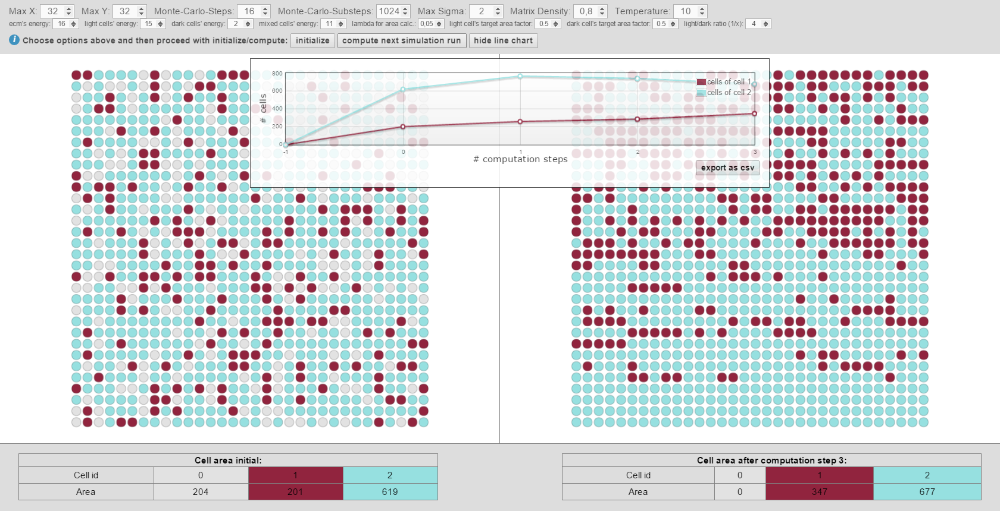
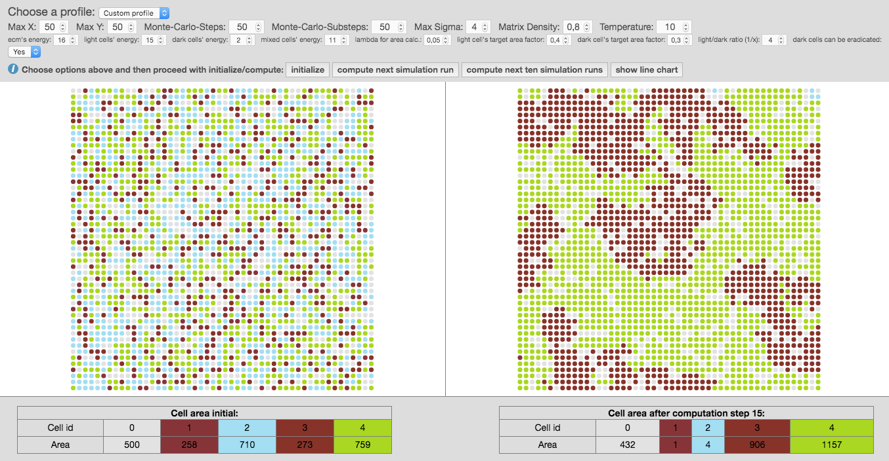
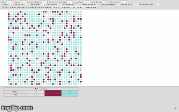

# cpm-cytoscape #

__In Silico Modeling for Tumor Growth Visualization__

A science project by 
F. Jeanquartier, C. Jean-Quartier, D. Cemernek and A. Holzinger with the Holzinger Group, Research Unit HCI-KDD.
Get in contact with one of the developers via mail [f.jeanquartier[at]hci-kdd.org](mailto:f.jeanquartier[at]hci-kdd.org)





## Overview of the app ##

This is app is for the purpose of scientific simulation and visual analysis of tumor growth.
 
The app makes use of the Cellular Potts Model (CPM) implemented in Java.  
The html5 frontend makes use of the cytoscape.js library for visualization output.

- CPM Model

The CPM model is a popular lattice-based, multi-particle cell-based formalism, also used for modeling tumor growth, first described by [Graner & Glazier 1992](http://www.if.ufrgs.br/~leon/cursopg/mod_min/Articles/PRL_69-13-2013.pdf).

- Cytoscape Visualization

We make use of the graph theory and visualization library [Cytoscape.js](http://js.cytoscape.org) to create simulation output in html.


### User Interface & Tutorial ###

[See the overview of the tool's user interface](img/cpm-cytosacpe-ui-description.pdf)

####Tutorial On Modeling Brain Tumor Growth####

1. Start the tool via the demo or offline according to the instructions presented below.
2. Go to the tools top section for input parameters and type in the values, given in list beneath. Alternatively, you can try out variations in order to simulate your own sample properties and start a new experiment. By varying several parameters the user is allowed to simulate a wide range of conditions.

  * 
    ```
Max X:50
  ```  
  * 
    ``` 
Max Y:50
  ```  
  * 
    ```
Monte-Carlo-Steps:25
  ```
  *  
    ```
Monte-Carlo-Substeps:10
  ```
  *  
    ```
Max Sigma:2
  ```
  *  
    ```
Matrix Density:1
  ```
  *  
    ```
Temperature:4
  ```
  *  
    ```
ecm's energy:8
  ```
  *  
    ```
light cells' energy:30
  ```
  *  
    ```
dark cells' energy:3
  ```
  *  
    ```
mixex cells' energy:2
  ```
  *  
    ```
lambda for area calc.:1
  ```
  *  
    ```
light cell's target area factor:1 (or 0.5 if you want the light cell's to grow)
  ```
  *  
    ```
dark cell's target area factor:1 (or 0.5 if you want the dark cell's to grow)
  ```
  *  
    ```
light/dark ratio:2
    ```


    >__Parameters comprise:__
    >  *<small style="font-size:0.75em;">
        lattice size ``x * y``, 
        count of ``monte carlo steps`` and ``substeps`` (representing units of time), 
        number of ``cell types σ``, namely dark (tumor) and light (normal) cells, 
        ``matrix density`` (given the cell density between dark and light cells in proportion to extracellular matrix), 
        ``temperature T`` (resembling cellular motility),      
        cell-type ``interaction parameters J`` (so-called boundary energy coefficient determining cell growth as multiplicative degree of freedom)
        cellular ``elasticity index λ`` (representing a growth limiting factor), 
        cell-type ``target areas``,         
        and initialization ``ratio`` between dark (tumor/mutated) and light (normal/healthy) cells
        </small>*

3. After pressing the button __[initialize]__, the graph is created on a grid, randomly presenting individual cells as group of nodes, also called cellular bricks. Colored nodes represent cellular bricks and uncolored nodes are part of the extracellular matrix and resemble the cellular environment without peculiar growth variables. Dark nodes, shown in red, are attributed to cancerous cells and light nodes, shown in blue, stand for normal cells.
4. Now you can use the button __[compute next simulation run]__ or calculate the next ten computation cycles at once by using the option [compute next two simulation runs]. The given experimental area will be then completely filled after 7 to 8 computation steps. So, malignant cells within the experimental area will have reached their critical mass by then. The simulated cancer cells grow according to Gompertz kinetics imitating 2D cultured glioma cells or spheroids implanted in animals (compare [Rubenstein et al. 2008](http://www.sciencedirect.com/science/article/pii/S0006349508819844)). One computation step now accounts for 50 hours. If you change input parameters of MCS and substeps the time factor will change appropriately, also depending on the size of matrix, given by parameters X and Y. Using the previous input parameters for X and Y equaling 50, the experimental area amounts for up to 2500 cells.
5. Press the button [show line chart] will give you the summary of previously calculated steps which you can download as spreadsheet using the option [export as csv]. The line chart shows the amount of computation steps on the x-axis and the amount of cellular bricks on the y-axis. 
6. Finally, we encourage readers to use GitHub for having a closer look at our implementation, explore it's features and suggest enhancements as well as participate in the development. :)


## How to Run and Deploy cpm-cytoscape in silico simulation app ##

The app can be easily deployed by making use of the WAR file. 
Another option is to deploy the whole source. 
We further encourage developers developers to revise existing.

### Prerequisites ###

To run this app you need a Java capable webserver such as Apache Tomcat and at least java version 1.7 to run the app.

### Option 1 : WAR file ###

Download the latest WAR file 'cpm-cytoscape.war' from `https://github.com/davcem/cpm-cytoscape/tree/master/target/cpm-cytoscape.war`. 
Deploy the war file on your Java capable Webserver such as Tomcat and start the server.
Open a webbrowser and type in the url to the deployed webapp such as `http://localhost:8080/cpm-cytoscape/` and start playing around with the app.

### Option 2 : Deploy the source ###

Download the latest sources from `https://github.com/davcem/cpm-cytoscape/tree/master/src/main`.
Create a webapp folder on your Java capable Webserver such as Tomcat and start start the server. 
Open a webbrowser and type in the url to the deployed webapp such as `http://localhost:8080/cpm-cytoscape/` and start playing around with the app.


## Contribute to our project ##

We __encourage__ you to have a look at our source code, give us [feedback](mailto:f.jeanquartier[at]hci-kdd.org) and contribute to the cpm-cytoscape project to foster in silico simulation in cancer research!


## Demo ##

We know, that not every clinician and/or scientist is able to run his own web servlet or respectively java capable webserver. 
Therefore, we further provide an online version, always running a stable version: 
[Try out our Online Demo](http://styx.cgv.tugraz.at:8080/cpm-cytoscape/) and  give us [feedback](mailto:f.jeanquartier[at]hci-kdd.org).

See an example showing several simulation steps as animated GIF also below: 

 

## Acknowledgments ##

We thank the CGV Institute of the University of Technology Graz for providing the demo server.
We thank the [HOLZINGER GROUP](http://hci-kdd.org) for giving us the opportunity to get feedback on this research.
We also thank all participants for their contributions to the development of components for cpm-cytoscape software. 

## License

The content of this project itself is licensed under the [Creative Commons Attribution 3.0 license](http://creativecommons.org/licenses/by/3.0/us/deed.en_US), and the underlying source code used to format and display that content is licensed under the [MIT license](http://opensource.org/licenses/mit-license.php).